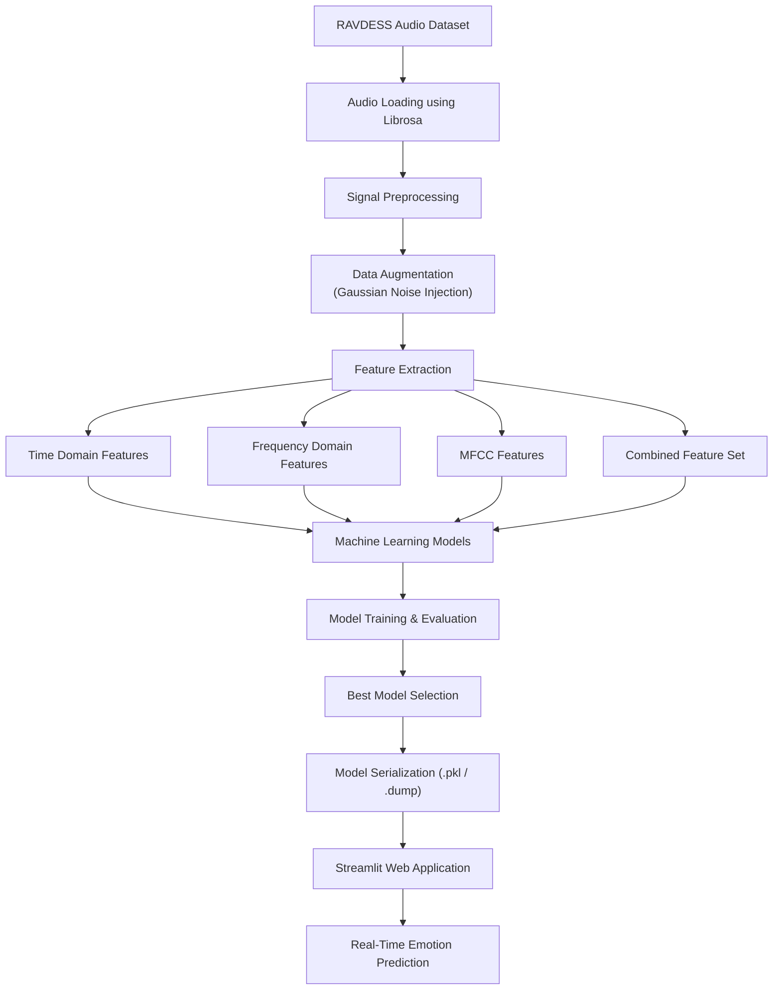

# `Speech Emotion Recognition using Machine Learning`

## Audio Signal Processing, Feature Engineering & Emotion Classification using Python

<p align="center">
  
  
  
  
  
</p>

---

# 📌 Overview

Speech carries rich emotional information through variations in pitch, tone, frequency distribution, and energy patterns. This project focuses on building a machine learning-based **Speech Emotion Recognition (SER)** system capable of classifying human emotions from audio signals.

The project explores the complete pipeline of:

* Audio signal preprocessing
* Feature extraction from speech signals
* Data augmentation
* Machine learning-based emotion classification
* Real-time inference using a Streamlit web application

The system was trained and evaluated on the **RAVDESS emotional speech dataset** using multiple classical machine learning models and audio feature representations.

---
# 🧠 Problem Statement

Human speech contains emotional characteristics that can be analyzed computationally using signal processing and machine learning techniques.

However, speech emotion recognition presents several challenges:

* Variability in speaking style (Pitch, Energy, Frequency distribution, Spectral characteristics)
* Noise sensitivity
* Speaker-dependent characteristics
* Limited labeled emotional datasets
* Feature extraction complexity

The goal of this project is to design a robust machine learning pipeline capable of extracting discriminative audio features and accurately classifying emotional states from speech recordings.

---
# 🎯 Objectives

## 1. Emotion Detection from Speech

Develop a machine learning system capable of classifying emotional states directly from human speech signals.

## 2. Audio Signal Processing

Extract meaningful temporal, spectral, and cepstral features from raw audio data for emotion classification.

## 3. Data Augmentation

Improve generalization and robustness using Gaussian noise-based augmentation techniques.

## 4. Comparative Model Evaluation

Analyze performance of multiple machine learning algorithms across different feature domains.

## 5. Real-Time Inference

Deploy a lightweight Streamlit-based application for live emotion prediction from uploaded audio samples.

---

# 📂 Dataset

## RAVDESS Dataset

The project uses the **Ryerson Audio-Visual Database of Emotional Speech and Song (RAVDESS)** dataset.

Dataset characteristics:

* 24 professional actors

  * 12 Male
  * 12 Female

* 8 emotional classes:

| Emotion ID | Emotion   |
| ---------: | --------- |
|          1 | Neutral   |
|          2 | Calm      |
|          3 | Happy     |
|          4 | Sad       |
|          5 | Angry     |
|          6 | Fearful   |
|          7 | Disgust   |
|          8 | Surprised |

The dataset filenames follow a structured naming convention, allowing automatic extraction of emotion labels during preprocessing.

---

# 🏗️ System Pipeline



---

# ⚙️ Methodology

# 1. Audio Signal Processing

Audio files are loaded using the **Librosa** library.

The library converts analog audio into:

* Digital discrete-time samples
* Time-series representations
* Sampling rate metadata

This enables numerical processing of speech signals for feature extraction and machine learning.

---

# 2. Data Augmentation

Gaussian noise was added to original audio signals to improve dataset diversity and model robustness.

### Purpose of augmentation:

* Improve generalization
* Reduce overfitting
* Increase variation in training samples
* Improve performance on unseen audio

Noise was generated using:

```python
np.random.normal()
```
* Symmetric Gaussian distribution

The augmentation preserves signal structure while introducing controlled perturbations.

---

# 3. Feature Extraction

The project evaluates multiple categories of speech features.

---

## A. Time Domain Features

Features directly extracted from waveform behavior over time.

### Zero Crossing Rate (ZCR)

Measures how frequently the signal changes sign:

* Positive → Negative
* Negative → Positive

Used to identify:

* Voiced speech
* Unvoiced speech
* Silent regions
* Signal intensity characteristics

Extracted statistics:

* ZCR Mean
* ZCR Standard Deviation
* ZCR Maximum

### Root Mean Square Energy (RMSE)

Measures signal energy and amplitude intensity.

---

## B. Frequency Domain Features

Time-domain signals are transformed into frequency representations using Fourier Transform techniques.

### Chroma Energy Distribution (CENS)

Represents distribution of energy across pitch classes:

* A
* A#
* B
* C
* etc.

Used for identifying similarities in tonal structure between speech samples.

### Mel Spectrogram Features

Speech frequencies are mapped to the **Mel Scale**, which approximates human auditory perception.

These features represent:

* Loudness variations
* Frequency-energy distribution
* Temporal-frequency relationships

---

## C. MFCC Features (Mel Frequency Cepstral Coefficients)

MFCCs capture both:

* Spectral properties
* Human perceptual characteristics

### MFCC pipeline:

```text
Audio Signal
    ↓
Frame Segmentation
    ↓
Window Function
    ↓
Fast Fourier Transform (FFT)
    ↓
Mel Spectrogram
    ↓
Log Compression
    ↓
Discrete Cosine Transform (DCT)
    ↓
MFCC Features
```

MFCCs were found to be the most informative features because they closely align with human speech perception.

---

# 🤖 Machine Learning Models

The following classifiers were evaluated:

| Model                           | Purpose                       |
| ------------------------------- | ----------------------------- |
| Decision Tree                   | Baseline tree model           |
| Random Forest                   | Ensemble learning             |
| Gradient Boosting               | Sequential boosting           |
| XGBoost                         | Optimized boosting            |
| LightGBM                        | Gradient boosting framework   |
| AdaBoost                        | Adaptive boosting             |
| Gaussian Naive Bayes            | Probabilistic classification  |
| K-Nearest Neighbors (KNN)       | Distance-based classification |
| MLP Classifier                  | Neural-network classifier     |
| Support Vector Classifier (SVC) | Margin-based classifier       |
| QDA                             | Quadratic decision boundaries |
| LDA                             | Linear discriminant analysis  |

---
# 🧪 Experimental Setup

Multiple training datasets were constructed using combinations of original and augmented audio samples to evaluate model robustness across different feature domains.

Feature groups evaluated:

* Time-domain features
* Frequency-domain features
* MFCC features
* Combined feature dataset
---
# 🧪 Experimental Results

## Best Performing Models

| Model         | Feature Set                          | Accuracy |
| ------------- | ------------------------------------ | -------- |
| LightGBM      | Frequency Domain + Augmented Dataset | 74.2%    |
| Random Forest | Frequency Domain + Augmented Dataset | 72.8%    |
| XGBoost       | All Features + Augmented Dataset     | 69.4%    |
| QDA           | MFCC Features                        | 61.7%    |

---

# 📊 Key Observations

* Frequency-domain features performed best after augmentation
* MFCC-only feature sets performed strongly on original datasets
* Time-domain features showed the weakest overall performance
* Gaussian noise augmentation improved generalization in most models
* LightGBM achieved the highest accuracy but showed signs of overfitting on some augmented datasets
* MLP classifier improved mainly on frequency-domain features but not significantly on combined feature sets

---
# 🧠 Why MFCC Features Performed Strongly

MFCC features performed strongly because they capture both:

* Spectral characteristics of speech
* Human auditory perception patterns

Unlike raw frequency-domain features, MFCCs compress information using the Mel scale and logarithmic transformations, making them more aligned with how humans perceive sound intensity and pitch variations.

Additionally, the Discrete Cosine Transform (DCT) reduces feature correlation and dimensional redundancy, enabling machine learning models to learn more discriminative emotional patterns from speech signals.

---

# 📈 Conclusions

From experimentation and comparative analysis:

* Frequency-domain and MFCC-based feature sets were the most effective for speech emotion recognition
* Time-domain-only features are insufficient for robust emotion classification
* Data augmentation improves classification performance in most scenarios
* Ensemble methods significantly outperform simpler classifiers
* LightGBM and Random Forest achieved the strongest overall results

The project demonstrates that carefully engineered audio features combined with classical machine learning techniques can achieve strong emotion classification performance without relying on large end-to-end deep learning architectures.

---

# 🌐 Streamlit Web Application

A Streamlit-based web application was developed for live emotion prediction from uploaded voice samples.

## Features
* Upload custom audio
* Real-time audio emotion inference
* Dynamic feature extraction pipeline
* Compatible with serialized Scikit-learn / LightGBM model deployment workflows
* Interactive web interface
#### 🔗 Live Demo
[Speech Emotion Recognition Web App](https://11happy-prml-course-project-app-87l83l.streamlit.app/)


---

# 🛠️ Technologies Used

| Category         | Tools                           |
| ---------------- | ------------------------------- |
| Programming      | Python                          |
| Audio Processing | Librosa                         |
| Machine Learning | Scikit-learn, XGBoost, LightGBM |
| Data Handling    | NumPy, Pandas                   |
| Visualization    | Matplotlib, Seaborn             |
| Deployment       | Streamlit                       |

---

# 🎯 Applications

Speech Emotion Recognition systems have applications in:

* Human-Computer Interaction (HCI)
* Intelligent virtual assistants
* Call center analytics
* Mental health monitoring
* Smart customer support systems
* Conversational AI
* Emotion-aware interfaces

---


# 📚 References

1. Librosa Audio Processing Library
   [https://librosa.org/](https://librosa.org/)

2. RAVDESS Emotional Speech Dataset
   [https://zenodo.org/record/1188976](https://zenodo.org/record/1188976)

3. Scikit-learn Documentation
   [https://scikit-learn.org/](https://scikit-learn.org/)

4. LightGBM Documentation
   [https://lightgbm.readthedocs.io/](https://lightgbm.readthedocs.io/)

5. XGBoost Documentation
   [https://xgboost.readthedocs.io/](https://xgboost.readthedocs.io/)

---
